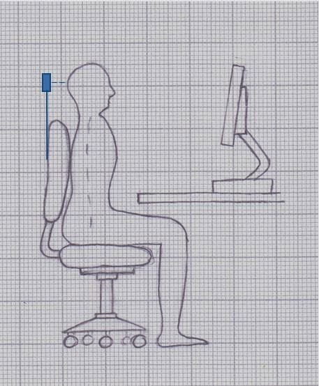
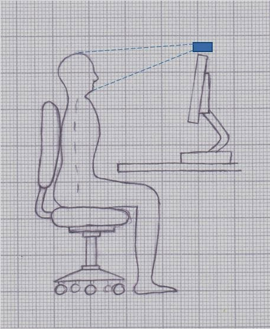
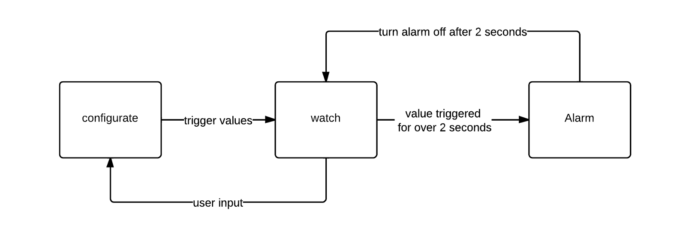

# HeadUp - A Webcam Posture Monitor

Since receiving a lot of feedback about my posture sensor solution I was thinking about how to improve it. Despite its functionality there are a few problems like the continuous clicking of the ultrasonic sensor and the way it is installed on the chair’s rest.

#### Ideas

One way of fixing the clicking noise would be to use an infrared-based proximity sensor. These are available in different operating ranges and prices but sadly I could not find one that was cheap enough and had the right range for the project.
Improving the chair holder is really difficult, too. It would require a lot of 3D-printed parts and still not work on chairs with low rests.
This meant the old idea had to be discarded completely and the project was suspended until I came across this great blog post about a pc-monitor-mounted sensor:
http://www.paleosun.com/blog/entry/prototyping-fun-with-a-posture-alarm

That’s how I got the idea of simply using the webcam as a sensor. Most people have cameras on their laptops and even desktop PCs so there is no additional hardware needed.

#### Implementation

Because I already used it in other projects I went with Processing as a programming language again:
https://www.processing.org/
To detect the position of the head the software has to scan the webcam image. This is a nearly impossible task without the help of a powerful library. OpenCV is the solution:
http://opencv.org/
OpenCV is an Open Source library that contains computer vision functions and was originally developed by Intel. Face detection is just a small part of it.
The “OpenCV for processing” library by Greg Borenstein can easily be downloaded with the Library Manager in Processing and already contains some example sketches to start with.

The software I wrote works in a similar way as the Arduino code in the posture sensor. It scans the webcam image and compares the height and the size (~distance) of the face to limit values. If the limits are exceeded for more than two seconds the alarm will sound and then silence after a few seconds. If the user gets up from his chair or the face is not visible the alarm will not be triggered. The alarm itself is just the Windows error sound. The user interface consists of the live image in the background. Three buttons are for setting up the limit values and for pausing the alarm.
Finally Processing can export everything into a standalone application.

#### Download

If you have a computer with a webcam you can give “HeadUp” a try:

:---:
https://www.dropbox.com/sh/j9ezha6dx37jlla/X0ZRXMsmrJ/HeadUp.zip

Instructions:
1. Download HeadUp.zip
2. Unzip everything into one folder
3. Run HeadUp.exe

### Conclusion

The new software based posture sensor is reliable and has none of its predecessor’s flaws. You can easily run the program in the background while working on the computer and it will remind you if you are slouching into the chair or getting too close to the screen.

About slouching: You should be aware that sinking into your chair and leaning back is not only more comfortable than sitting upright but does also relieve your spine. The software rather prevents you from hunching over which even unhealthier.
